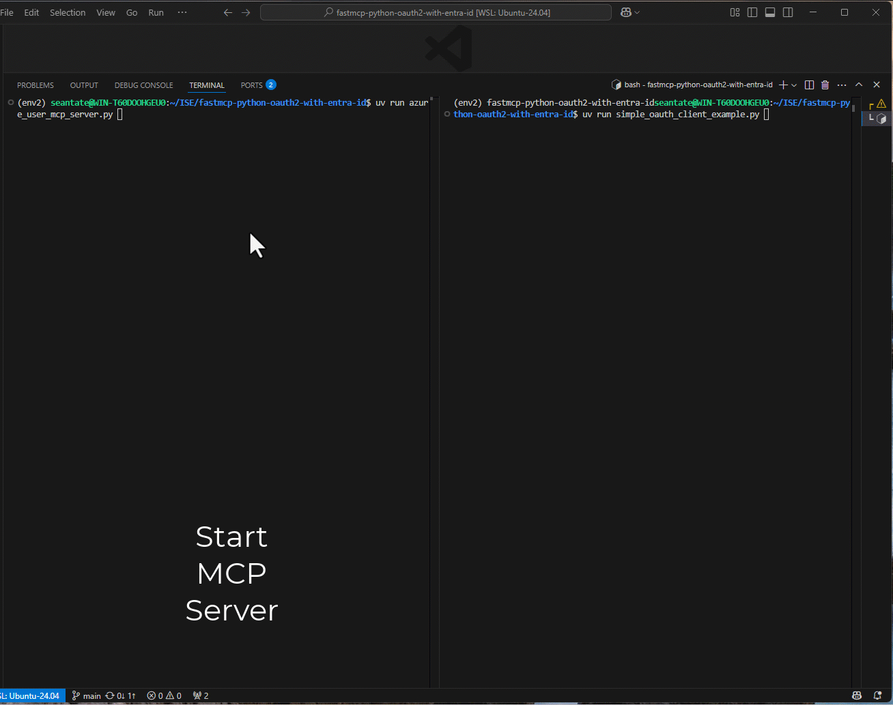
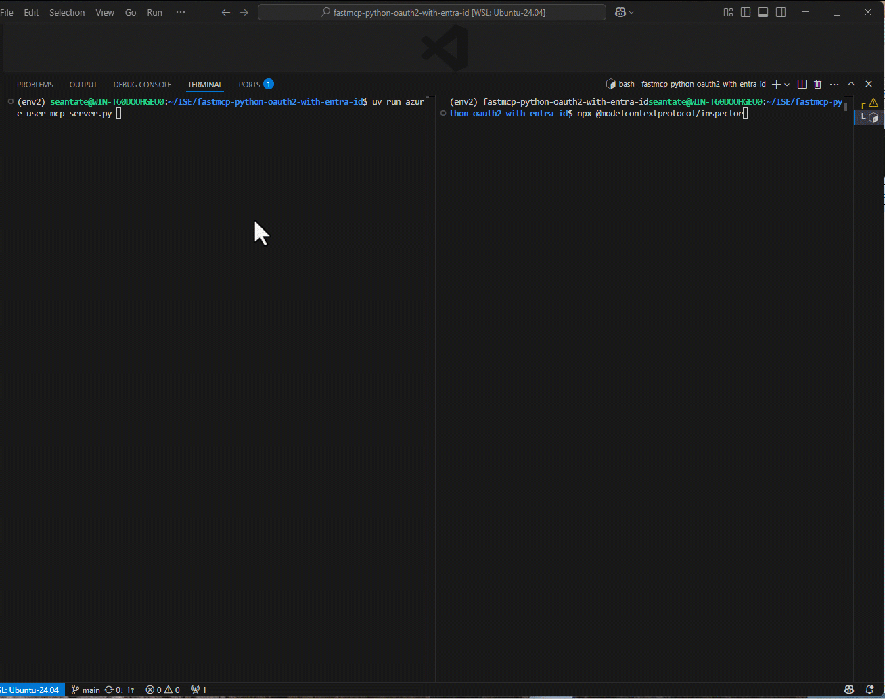

# MCP Server Authorization Example (OAuth2 + Entra ID)

This demonstration shows how to secure an MCP server using the [MCP Authorization specification](https://modelcontextprotocol.io/specification/2025-03-26/basic/authorization) with Entra ID as a third party authorization server. This example includes an implementation of `OAuthAuthorizationServerProvider` from the [MCP Python SDK](https://github.com/modelcontextprotocol/python-sdk) tailored for Microsoft Entra ID.

## Server Functionality

The MCP server provides a demonstration tool called `get_user_name` that showcases how authenticated user information can be accessed within MCP tools. This tool:

- **Requires Authentication:** The tool can only be invoked after successful OAuth2 authentication with Entra ID
- **Returns User Information:** Provides the user's display name as obtained from their Entra ID profile
- **Demonstrates Authorization Flow:** Shows how the MCP Authorization specification enables secure access to user-specific data

This simple tool demonstrates the complete OAuth2 flow from authentication through to accessing protected resources with user context.

> This solution is for demonstration purposes only and is not suitable for production use cases. In some cases, code comments highlight areas that require attention.

## Components

- **Server:** `azure_user_mcp_server.py`
    - Implements an MCP server protected by OAuth2 Bearer tokens (Entra ID).
- **Client:** `simple_oauth_client_example.py`
    - Console-based client that authenticates with the MCP server using the OAuth2 Authorization Code flow (with PKCE).

## Environment Setup

Create a `.env` file in the project root with the following variables:

```
AUTH_TENANT_ID=your-tenant-id
AUTH_CLIENT_ID=your-client-id
AUTH_CLIENT_SECRET=your-client-secret
# Optional:
# AUTH_AUTHORITY=login.microsoftonline.com
# AUTH_REDIRECT_URI=http://localhost:8000/auth/callback
```

- `AUTH_TENANT_ID`: Your Entra ID (Azure AD) tenant ID
- `AUTH_CLIENT_ID`: The client/application ID registered in Entra ID
- `AUTH_CLIENT_SECRET`: The client secret (for confidential clients)
- `AUTH_REDIRECT_URI`: Redirect URI for the MCP server (default: `http://localhost:8000/auth/callback`)

## How to Run the Demo

1. **Install dependencies:**
   ```bash
   pip install uv
   uv sync
   ```

2. **Start the MCP Server:**
   From the project root, run:
   ```bash
    uv run azure_user_mcp_server.py
   ```

3. **Run the OAuth2 Console Client:**
   In a new terminal, from the project root, run:
   ```bash
     uv run simple_oauth_client_example.py
   ```
   The client will:
   - Attempt to access the protected resource (expecting 401)
   - Initiate the OAuth2 Authorization Code flow
   - Print the authorization URL to the console (open in browser to authenticate)
   - Handle the callback and exchange the code for a token
   - Connect to the server and allow the user to interact with the MCP server via common functions such as listing available tools and invoking a tool.

   

## Using MCP Inspector to Access the MCP Server

MCP Inspector is a graphical tool for interacting with MCP servers.

- **Installation:**
  - Follow the official installation instructions on the MCP website: [MCP Inspector Installation Guide](https://modelcontextprotocol.io/docs/tools/inspector)

- **Authentication:**
  1. Launch MCP Inspector after installation.
  2. Connect to the MCP server at the appropriate URL (e.g., `http://localhost:8000/sse`). 

  This allows you to interact with the secured MCP server using the graphical interface, authenticated with a valid OAuth2 token.

     

## Security: Confused Deputy Protection

This implementation includes protection against the **confused deputy attack**, a security vulnerability that can occur in OAuth2 flows where an MCP server acts as both an OAuth2 client and a service provider.

### The Confused Deputy Threat

In a confused deputy attack scenario:

1. **The MCP Server as Deputy:** The MCP server acts as a "deputy" - it has legitimate access to protected resources (like Microsoft Graph APIs) on behalf of authenticated users
2. **Malicious Client Exploitation:** A malicious MCP client could potentially trick the server into making unauthorized API calls by:
   - Sending crafted requests to a user that has previously authorized and consented with Azure, but with the client id and redirect URI of a malicious actor could cause an MCP server to leak access to a malicious actor.

### Attack Flow Diagram

The following diagram illustrates how a malicious actor could exploit the confused deputy vulnerability:

```mermaid
%%{init: {'theme':'dark'}}%%
sequenceDiagram
    participant U as Legitimate User
    participant LC as Legitimate Client
    participant MS as MCP Server
    participant EA as Entra ID
    participant MA as Malicious Actor
    participant MC as Malicious Client

    Note over U,MC: Confused Deputy Attack Scenario

    %% Step 1: Legitimate user setup
    rect rgb(40, 80, 40)
        Note over U,EA: Phase 1: Legitimate User Setup
        U->>LC: Connect MCP client to server
        LC->>MS: Initiate OAuth flow
        MS->>EA: Authorize with server credentials
        EA->>U: Present consent screen
        U->>EA: Authenticate & consent
        EA->>U: Set consent cookie in browser
        EA->>MS: Return authorization code
        MS->>LC: Complete legitimate connection
    end

    %% Step 2: Malicious actor preparation
    rect rgb(100, 20, 20)
        Note over MA,MS: Phase 2: Malicious Client Registration
        MA->>MS: Use dynamic client registration
        MS->>MA: Register malicious client & return client_id
        MA->>MA: Craft malicious authorization link<br/>with own client_id & redirect_uri
    end

    %% Step 3: Attack execution
    rect rgb(100, 20, 20)
        Note over MA,EA: Phase 3: Attack Execution
        MA->>U: Send crafted link (phishing/social engineering)
        U->>MS: Click link - redirected to OAuth endpoint
        MS->>EA: Start OAuth flow with malicious client_id
        Note over EA: Existing consent cookie found!<br/>No new consent required
        EA->>MS: Auto-approve & return auth code
        MS->>MC: Redirect to malicious client's redirect_uri
        MC->>MA: Malicious client receives tokens
        MA->>EA: Use tokens to access Graph APIs
        Note over MA,EA: Gains access with server's elevated permissions
    end
    
    Note over U,MC: User's existing consent bypassed additional authorization,<br/>malicious actor gains server-level access to user data
```



### Example Attack Vector

Consider this scenario:
- A legitimate user connects their MCP client to your server and consents to Entra ID access
- Entra ID stores a consent cookie in the user's browser for future authentications
- A malicious actor uses your server's dynamic client registration to register their own client
- The malicious actor crafts a link using their registered client_id and redirect_uri

**Example of malicious URL:**
```
http://your-mcp-server.com/auth/authorize?response_type=code&client_id=malicious-client-123&redirect_uri=https://evil-actor.com/callback&scope=user.read
                                                                    ^^^^^^^^^^^^^^^^^^^               ^^^^^^^^^^^^^^^^^^^^^^^^^^^^^^^
                                                                    Malicious Client ID               Attacker's Redirect URI
```

- When the legitimate user clicks the malicious link:
  - They're redirected through your MCP server's OAuth flow
  - Entra ID finds the existing consent cookie and auto-approves without showing a consent screen
  - The authorization code gets sent to the malicious actor's registered redirect URI (`https://evil-actor.com/callback`)
  - The malicious actor gains access tokens with your server's scope and permissions

### Protection Mechanism: Consent Screen

To mitigate this threat, this implementation includes an **additional consent screen** during the intial MCP client authorization that:

1. **Explicit User Consent:** Before any protected operations, users must review and explicitly consent to authorizing the MCP client.
2. **Scope Limitation:** The consent screen clearly defines what resources and operations will be accessible

> Subsequent authorizations by the same client will not require consent as long as a valid consent cookie is present.

#### Cookie-Based Protection Implementation

The consent screen protection is enforced through a sophisticated cookie-based validation system:

**Consent Cookie Generation:**
- When a user grants consent, the server generates a cryptographically signed cookie containing:
  - `application_id`: The client ID requesting access
  - `redirect_uri`: The registered redirect URI for the client
  - `scopes`: The specific permissions being granted
  - `expires_on`: Cookie expiration timestamp (30 days by default)
  - `signature`: HMAC signature using the server's auth key to prevent tampering

**Consent Validation Flow:**
1. **Initial Request:** When an OAuth authorization request arrives, the server checks for a valid consent cookie
2. **Cookie Verification:** If a cookie exists, the server validates:
   - The cookie signature matches the expected hash (preventing tampering)
   - The cookie hasn't expired
   - The `application_id` matches the requesting client
   - The `redirect_uri` matches the registered client redirect URI
   - The `scopes` match the requested permissions
3. **Protection Decision:**
   - **Valid Cookie Found:** Authorization proceeds directly to Entra ID
   - **No Valid Cookie:** User is redirected to the consent screen first

**Security Benefits:**
- **Prevents Replay Attacks:** Each consent cookie is tied to specific client credentials
- **Tamper-Proof:** Cryptographic signatures prevent malicious modification
- **Time-Bound:** Cookies expire, requiring periodic re-consent
- **Scope-Specific:** Consent is granular to the exact permissions requested

This ensures that even if a malicious client attempts to exploit the server's permissions, the user maintains explicit control over what actions are actually performed on their behalf.


> **Acknowledgment:** Special thanks to [Den Delimarsky](https://den.dev/) for bringing the confused deputy threat vector to our attention. For an in-depth analysis of this vulnerability in the context of MCP and API management, see his detailed blog post: [The Confused Deputy Problem in MCP and API Management](https://den.dev/blog/mcp-confused-deputy-api-management/).

## Notes

- **Azure Application Registration Required:** Before running this demo, you must create an application registration in Microsoft Entra ID (Azure AD). This registration provides the `AUTH_CLIENT_ID`, `AUTH_CLIENT_SECRET`, and `AUTH_TENANT_ID` values needed in your `.env` file.

- **Setup Instructions:** For detailed steps on creating an application registration, configuring redirect URIs, and generating client secrets, follow the official Microsoft documentation: [Register an application with Microsoft identity platform](https://docs.microsoft.com/en-us/azure/active-directory/develop/quickstart-register-app)

- **Redirect URI Configuration:** Ensure your application registration includes `http://localhost:8000/auth/callback` as a valid redirect URI in the authentication settings.


