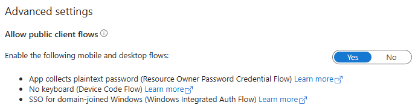

# MCP Server Authorization Example (OAuth2 + Entra ID)

This demonstration shows how to secure an MCP server using the [MCP Authorization specification](https://modelcontextprotocol.io/specification/2025-03-26/basic/authorization) with Entra ID as a third party authorization server. This example includes an implementation of `OAuthAuthorizationServerProvider` from the [MCP Python SDK](https://github.com/modelcontextprotocol/python-sdk) tailored for Microsoft Entra ID.

## Server Functionality

The MCP server provides a demonstration tool called `get_user_name` that showcases how authenticated user information can be accessed within MCP tools. This tool:

- **Requires Authentication:** The tool can only be invoked after successful OAuth2 authentication with Entra ID
- **Returns User Information:** Provides the user's display name as obtained from their Entra ID profile
- **Demonstrates Authorization Flow:** Shows how the MCP Authorization specification enables secure access to user-specific data

This simple tool demonstrates the complete OAuth2 flow from authentication through to accessing protected resources with user context.

> This solution is for demonstration purposes only and is not suitable for production use cases. In some cases, code comments highlight areas that require attention.

## Components

- **Server:** `azure_user_mcp_server.py`
    - Implements an MCP server protected by OAuth2 Bearer tokens (Entra ID).
- **Client:** `simple_oauth_client_example.py`
    - Console-based client that authenticates with the MCP server using the OAuth2 Authorization Code flow (with PKCE).

## Environment Setup

Create an Entra App registration and enable public client flows in the `Authentication` options. This ensures the server doesn't require secrets when doing the token exchange.



Create a `.env` file in the project root with the following variables:

```
AUTH_TENANT_ID=your-tenant-id
AUTH_CLIENT_ID=your-client-id
# Optional:
# AUTH_AUTHORITY=login.microsoftonline.com
# AUTH_REDIRECT_URI=http://localhost:8000/auth/callback
```

- `AUTH_TENANT_ID`: Your Entra ID (Azure AD) tenant ID
- `AUTH_CLIENT_ID`: The client/application ID registered in Entra ID
- `AUTH_REDIRECT_URI`: Redirect URI for the MCP server (default: `http://localhost:8000/auth/callback`)

## How to Run the Demo

1. **Install dependencies:**
   ```bash
   pip install uv
   uv sync
   ```

2. **Start the MCP Server:**
   From the project root, run:
   ```bash
   make start-server
   ```

3. **Run the OAuth2 Console Client:**
   In a new terminal, from the project root, run:
   ```bash
   make start-client
   ```
   The client will:
   - Attempt to access the protected resource (expecting 401)
   - Initiate the OAuth2 Authorization Code flow
   - Print the authorization URL to the console (open in browser to authenticate)
   - Handle the callback and exchange the code for a token
   - Connect to the server and allow the user to interact with the MCP server via common functions such as listing available tools and invoking a tool.

   

## Using MCP Inspector to Access the MCP Server

MCP Inspector is a graphical tool for interacting with MCP servers.

- **Installation:**
  - Follow the official installation instructions on the MCP website: [MCP Inspector Installation Guide](https://modelcontextprotocol.io/docs/tools/inspector)

- **Authentication:**
  1. Launch MCP Inspector after installation.
  2. Connect to the MCP server at the appropriate URL (e.g., `http://localhost:8000/sse`). 

  This allows you to interact with the secured MCP server using the graphical interface, authenticated with a valid OAuth2 token.

     

## Notes

- **Azure Application Registration Required:** Before running this demo, you must create an application registration in Microsoft Entra ID (Azure AD). This registration provides the `AUTH_CLIENT_ID` and `AUTH_TENANT_ID` values needed in your `.env` file.

- **Setup Instructions:** For detailed steps on creating an application registration and configuring redirect URIs follow the official Microsoft documentation: [Register an application with Microsoft identity platform](https://docs.microsoft.com/en-us/azure/active-directory/develop/quickstart-register-app)

- **Redirect URI Configuration:** Ensure your application registration includes `http://localhost:8000/auth/callback` as a valid redirect URI in the authentication settings.


